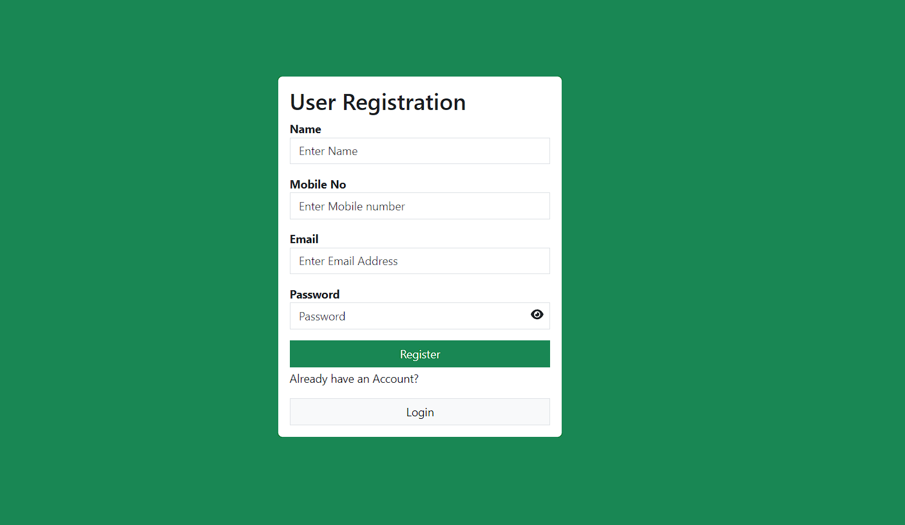

# User Authentication System

User Authentication System is a simple project built with the MERN stack, featuring three major functionalities: User Registration, User Login, and Reset Password.

## Installation

### Front-End App

1. Create a new folder for the front-end application:

    ```bash
   mkdir Front-End-App
   
2. Initialize a new Vite project:

    ```bash
   npm init vite@latest
    ```

Enter your project name.
Select React as the framework.
Choose JavaScript as the language.

3. Navigate to the project folder:

     ```bash
   cd Front-End-App

4. Install dependencies:

    ```bash
    npm install
    npm install axios bootstrap
    npm install @fortawesome/react-fontawesome @fortawesome/free-solid-svg-icons
    npm install react-toastify
    ```

5. Start the client : 

    ```bash
    npm run dev    
    ```

### Server Side App

1. Create a new folder for the server-side application:

  ```bash
   cd server-End-App
   ```

2. Navigate to the project folder:

    ```bash
   cd server-End-App
   ```

3. Install dependencies:

    ```bash
    npm install
    npm install express mongoose cors nodemon cookie-parser bcrypt jsonwebtoken
    ```


4. Load the Nodemon for start the server:

    Under the package.json , go to "scripts" , fill the "start" as "nodemon index.js"


5. Start the server:

    ```bash
    npm start
    ```


6. Create models folder for creating the database schema

    Use the User.js for databse schema


### Screenshot


#### Registration Page
